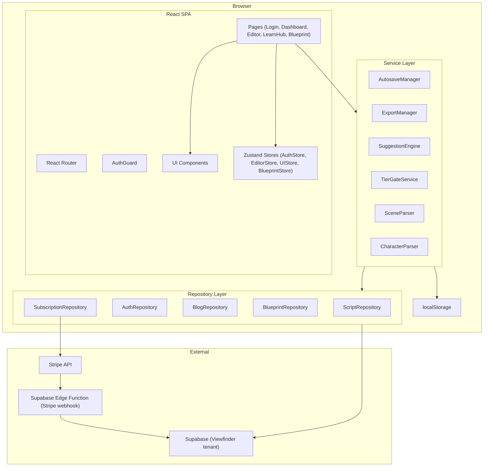
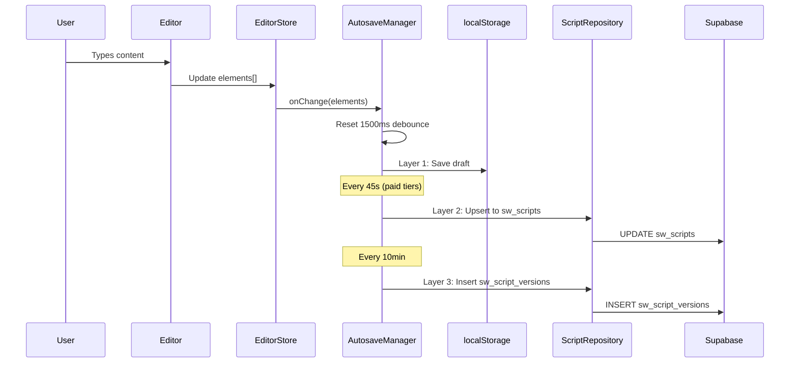
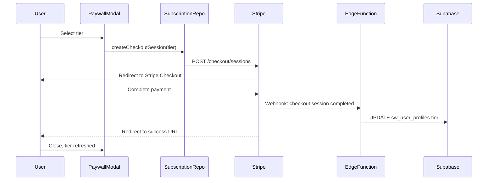
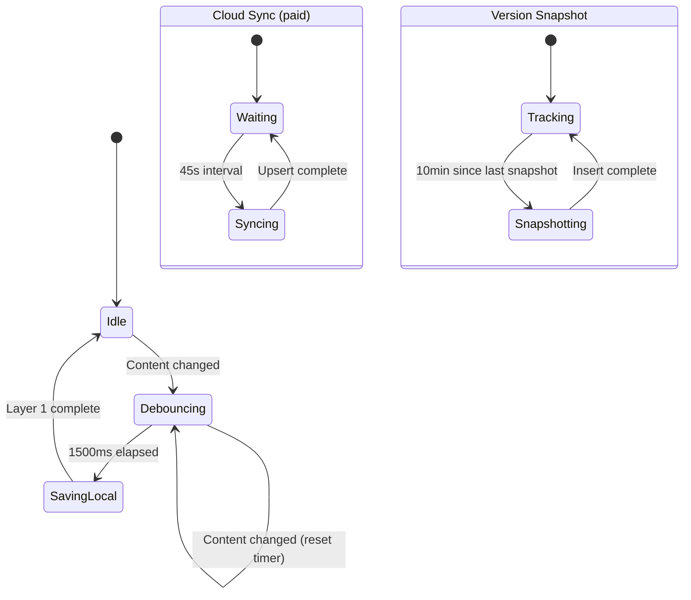
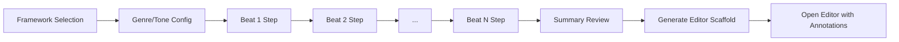
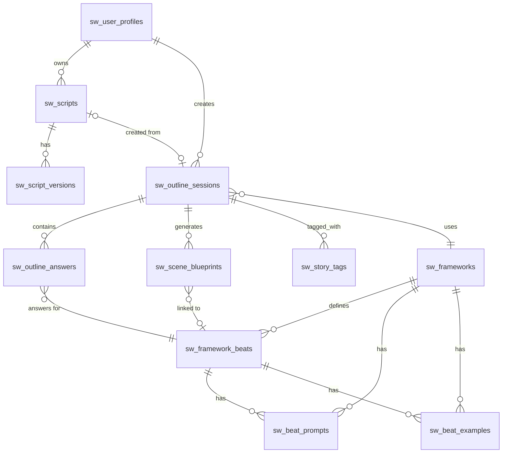

# Design Document — DraftKit Screenwriter (Web)

## Overview

DraftKit is a dark-mode, web-based screenwriting application built with React 18+, TypeScript, and Supabase. It provides industry-standard screenplay formatting via a custom rich text editor, a three-layer autosave system, multi-format export (PDF, .fdx, .fountain), and a Story Blueprint guided outlining add-on. Monetization uses Stripe Checkout with three tiers (Free, Writer $6.99/mo, Pro $13.99/mo).

The frontend is a single-page application using React Router for navigation. All business logic lives in service and repository classes — React components are purely presentational. The backend is an existing Supabase tenant (Viewfinder) with all tables prefixed `sw_`. No AI/LLM services are used; the suggestion engine is entirely database-driven.

### Key Technical Choices

| Decision | Choice | Rationale |
|---|---|---|
| Rich text editor | ProseMirror (via TipTap) | Extensible schema model maps cleanly to ScreenplayElement types; custom node types, keyboard handling, and decorations are first-class |
| State management | Zustand | Lightweight, TypeScript-friendly, no boilerplate; stores for auth, editor, UI, and blueprint |
| PDF generation | jsPDF + custom layout engine | Client-side generation, no server dependency; full control over screenplay margins and pagination |
| .fdx export | Custom XML builder (xmlbuilder2) | Final Draft XML is a well-documented schema; lightweight library |
| .fountain export | Custom serializer/parser | Fountain is a plain-text markup; simple to implement |
| Autosave Layer 1 | localStorage | Zero-latency, works offline, 1500ms debounce |
| Autosave Layer 2 | Supabase upsert | 45-second interval cloud sync for paid tiers |
| Autosave Layer 3 | sw_script_versions insert | 10-minute interval version snapshots |
| Payments | Stripe Checkout + webhooks | Industry standard for web SaaS; Supabase Edge Function handles webhook |
| Font | Courier Prime (bundled) | Industry-standard screenplay font, open-source |
| Routing | React Router v6 | Standard SPA routing with protected route wrappers |

## Architecture

### High-Level Component Diagram



### Data Flow — Editor Autosave



### Data Flow — Stripe Payment



## Components and Interfaces

### Frontend Component Hierarchy

```
App
├── AuthGuard
│   ├── DashboardPage
│   │   ├── DashboardToolbar (New Script button, search)
│   │   └── ScriptCardGrid
│   │       └── ScriptCard (title, page count, timestamp, context menu)
│   │           └── ScriptContextMenu (Rename, Duplicate, Delete)
│   ├── EditorPage
│   │   ├── EditorToolbar (title, page count, save status, panel toggle)
│   │   ├── ScreenplayEditor (TipTap/ProseMirror instance)
│   │   └── SidePanel
│   │       ├── ScenePanel
│   │       ├── CharacterTracker
│   │       └── BeatSheetOverlay
│   ├── VersionHistoryPage
│   │   ├── VersionList
│   │   └── VersionPreview
│   ├── LearnHubPage
│   │   ├── CategoryFilter
│   │   ├── BlogPostGrid
│   │   └── BlogPostDetail
│   ├── BlueprintWizardPage
│   │   ├── FrameworkSelector
│   │   ├── GenreToneConfig
│   │   ├── BeatStepWizard
│   │   │   ├── BeatPromptPanel
│   │   │   ├── BeatExamplePanel
│   │   │   └── BeatAnswerInput
│   │   └── BlueprintSummary
│   └── SettingsPage
│       └── SubscriptionPanel
├── PaywallModal
└── LoginPage
    ├── EmailPasswordForm
    └── SocialLoginButtons
```

### Service Interfaces

```typescript
// === Core Types ===

type ElementType =
  | 'SCENE_HEADING'
  | 'ACTION'
  | 'CHARACTER'
  | 'DIALOGUE'
  | 'PARENTHETICAL'
  | 'TRANSITION'
  | 'TITLE_PAGE';

interface ScreenplayElement {
  id: string;
  type: ElementType;
  text: string;
  order: number;
}

type Tier = 'free' | 'writer' | 'pro';

type SaveStatus = 'saved' | 'saving' | 'unsaved';

interface Script {
  id: string;
  userId: string;
  title: string;
  elements: ScreenplayElement[];
  pageCount: number;
  createdAt: string;
  updatedAt: string;
}

interface ScriptVersion {
  id: string;
  scriptId: string;
  elements: ScreenplayElement[];
  createdAt: string;
}

// === Repository Interfaces ===

interface IScriptRepository {
  getScripts(userId: string): Promise<Script[]>;
  getScript(scriptId: string): Promise<Script>;
  createScript(userId: string, title: string): Promise<Script>;
  updateScript(scriptId: string, updates: Partial<Script>): Promise<void>;
  duplicateScript(scriptId: string): Promise<Script>;
  deleteScript(scriptId: string): Promise<void>;
  getVersions(scriptId: string, limit?: number): Promise<ScriptVersion[]>;
  createVersion(scriptId: string, elements: ScreenplayElement[]): Promise<ScriptVersion>;
  restoreVersion(scriptId: string, versionId: string): Promise<void>;
}

interface IAuthRepository {
  signUp(email: string, password: string): Promise<User>;
  signIn(email: string, password: string): Promise<User>;
  signInWithProvider(provider: 'google' | 'github'): Promise<void>;
  signOut(): Promise<void>;
  getSession(): Promise<Session | null>;
  onAuthStateChange(callback: (user: User | null) => void): () => void;
}

interface IBlueprintRepository {
  getFrameworks(): Promise<Framework[]>;
  getFrameworkBeats(frameworkId: string): Promise<Beat[]>;
  createOutlineSession(session: Omit<OutlineSession, 'id'>): Promise<OutlineSession>;
  saveOutlineAnswer(answer: Omit<OutlineAnswer, 'id'>): Promise<void>;
  getOutlineSession(sessionId: string): Promise<OutlineSession>;
  getOutlineAnswers(sessionId: string): Promise<OutlineAnswer[]>;
}

interface IBlogRepository {
  getPosts(category?: string): Promise<BlogPost[]>;
  getPost(postId: string): Promise<BlogPost>;
  getCategories(): Promise<string[]>;
}

interface ISubscriptionRepository {
  getUserTier(userId: string): Promise<Tier>;
  createCheckoutSession(userId: string, tier: 'writer' | 'pro'): Promise<string>; // returns Stripe checkout URL
  getSubscriptionStatus(userId: string): Promise<SubscriptionStatus>;
}

// === Service Interfaces ===

interface IAutosaveManager {
  start(scriptId: string): void;
  stop(): void;
  onContentChange(elements: ScreenplayElement[]): void;
  getLocalDraft(scriptId: string): { elements: ScreenplayElement[]; timestamp: number } | null;
  resolveConflict(scriptId: string): Promise<ScreenplayElement[]>;
}

interface IExportManager {
  exportPDF(script: Script): Promise<Blob>;
  exportFDX(script: Script): Promise<string>;
  exportFountain(script: Script): Promise<string>;
  parseFountain(fountain: string): ScreenplayElement[];
  parseFDX(fdx: string): ScreenplayElement[];
}

interface ISuggestionEngine {
  getPrompts(frameworkId: string, beatId: string, genre: string, storyType: string): Promise<BeatPrompt[]>;
  getExamples(frameworkId: string, beatId: string, genre: string): Promise<BeatExample[]>;
  getFallbackPrompts(frameworkId: string, beatId: string): Promise<BeatPrompt[]>;
}

interface ITierGateService {
  canCreateScript(userId: string): Promise<boolean>;
  canAccessFeature(userId: string, feature: GatedFeature): Promise<boolean>;
  getScriptCount(userId: string): Promise<number>;
}

type GatedFeature =
  | 'cloud_sync'
  | 'fdx_export'
  | 'fountain_export'
  | 'beat_sheet_premium'
  | 'version_history_full'
  | 'ad_free'
  | 'unlimited_scripts';
```

### Zustand Store Shapes

```typescript
// AuthStore
interface AuthState {
  user: User | null;
  tier: Tier;
  loading: boolean;
  signIn: (email: string, password: string) => Promise<void>;
  signInWithProvider: (provider: 'google' | 'github') => Promise<void>;
  signUp: (email: string, password: string) => Promise<void>;
  signOut: () => Promise<void>;
  refreshTier: () => Promise<void>;
}

// EditorStore
interface EditorState {
  script: Script | null;
  elements: ScreenplayElement[];
  saveStatus: SaveStatus;
  activePanelTab: 'scenes' | 'characters' | 'beats' | null;
  showBlueprintAnnotations: boolean;
  setElements: (elements: ScreenplayElement[]) => void;
  updateElement: (id: string, updates: Partial<ScreenplayElement>) => void;
  insertElement: (afterId: string, element: ScreenplayElement) => void;
  deleteElement: (id: string) => void;
  cycleElementType: (id: string) => void;
  setSaveStatus: (status: SaveStatus) => void;
}

// BlueprintStore
interface BlueprintState {
  framework: Framework | null;
  genre: string;
  format: string;
  tone: string;
  currentBeatIndex: number;
  answers: Record<string, string>;
  sessionId: string | null;
  setFramework: (fw: Framework) => void;
  setGenreToneFormat: (genre: string, format: string, tone: string) => void;
  advanceBeat: () => void;
  setAnswer: (beatId: string, answer: string) => void;
}
```


### Editor Architecture (TipTap / ProseMirror)

The screenplay editor is built on TipTap (a headful wrapper around ProseMirror) with a custom schema that maps each `ElementType` to a ProseMirror node type.

#### ProseMirror Schema

```
Document
└── ScreenplayBlock (attrs: { elementType, elementId, order })
    └── Text (with marks: bold, italic, underline)
```

Each `ScreenplayBlock` node carries an `elementType` attribute. The editor applies CSS classes per type to achieve formatting (uppercase, centering, indentation) rather than inline styles. This keeps the document model clean and the rendering declarative.

#### ElementType → Editor Mapping

| ElementType | CSS Class | Visual Treatment |
|---|---|---|
| SCENE_HEADING | `.el-scene-heading` | Uppercase, bold, full-width |
| ACTION | `.el-action` | Standard left-aligned |
| CHARACTER | `.el-character` | Uppercase, centered (margin-left: 40%) |
| DIALOGUE | `.el-dialogue` | Indented (margin: 0 25% 0 15%) |
| PARENTHETICAL | `.el-parenthetical` | Indented, auto-wrapped in parens |
| TRANSITION | `.el-transition` | Uppercase, right-aligned |
| TITLE_PAGE | `.el-title-page` | Centered, dedicated first page |

#### Keyboard Plugin

A custom TipTap extension handles screenplay-specific keyboard behavior:

- **Tab**: Cycles the current block's `elementType` through the defined order (SCENE_HEADING → ACTION → CHARACTER → DIALOGUE → PARENTHETICAL → TRANSITION → SCENE_HEADING)
- **Enter**: Context-aware new block creation based on current element type:
  - After CHARACTER → new DIALOGUE
  - After DIALOGUE → new CHARACTER
  - After TRANSITION → new SCENE_HEADING
  - After ACTION → new ACTION
  - On empty block → convert to ACTION

#### Editor ↔ ScreenplayElement[] Serialization

Two pure functions handle conversion:

```typescript
function editorStateToElements(doc: ProseMirrorNode): ScreenplayElement[];
function elementsToEditorState(elements: ScreenplayElement[]): ProseMirrorNode;
```

These are the critical round-trip functions tested by property-based tests. The editor store calls `editorStateToElements` on every change to keep the `ScreenplayElement[]` in sync for autosave and export.

#### Blueprint Annotations

Blueprint annotations (beat markers, reminders) are implemented as ProseMirror decorations, not document nodes. This means:
- They render visually but are not part of the document content
- Toggling them on/off is a decoration filter, not a document mutation
- They don't appear in exports

### Autosave System Design



#### Conflict Resolution

When the editor loads a script:
1. Read localStorage draft for `script:{scriptId}` — extract `elements` and `timestamp`
2. Fetch cloud version from `sw_scripts` — extract `elements` and `updated_at`
3. Compare timestamps: use whichever is newer
4. If localStorage is newer (offline edits), the cloud version is overwritten on next Layer 2 sync

#### localStorage Schema

```
Key: `draftkit:draft:{scriptId}`
Value: JSON.stringify({ elements: ScreenplayElement[], timestamp: number })
```

### Export Pipeline

#### PDF Generation

Uses jsPDF with a custom layout engine:
1. Parse `ScreenplayElement[]` into layout blocks with type-specific margins
2. Apply Courier Prime 12pt (embedded as base64 font in jsPDF)
3. Page dimensions: US Letter (8.5" × 11"), margins: 1.5" left, 1" top/right/bottom
4. Pagination: track Y position, insert page breaks, add page numbers top-right
5. Title page: render TITLE_PAGE elements centered on page 1, screenplay starts on page 2

#### .fdx Export

Uses xmlbuilder2 to construct Final Draft XML:
1. Map each `ScreenplayElement` to a `<Paragraph>` node with `Type` attribute
2. Wrap in `<FinalDraft>` → `<Content>` structure
3. Output as XML string

#### .fountain Export

Custom serializer following the Fountain spec:
- SCENE_HEADING: prefix with `.` if not starting with INT./EXT., otherwise raw uppercase
- CHARACTER: uppercase name followed by newline
- DIALOGUE: indented text below character
- PARENTHETICAL: wrapped in parens
- TRANSITION: suffixed with `TO:` or prefixed with `>`
- ACTION: plain text with blank line separation

Corresponding parser reverses the process for round-trip validation.

### Story Blueprint Wizard Flow



#### Suggestion Engine Architecture

The SuggestionEngine is a pure query layer with no AI:

```
SuggestionEngine.getPrompts(frameworkId, beatId, genre, storyType)
  → SELECT * FROM sw_beat_prompts
    WHERE framework_id = $1 AND beat_id = $2
    AND (genre = $3 OR genre IS NULL)
    AND (story_type = $4 OR story_type IS NULL)
    ORDER BY specificity DESC, sort_order ASC

SuggestionEngine.getExamples(frameworkId, beatId, genre)
  → SELECT * FROM sw_beat_examples
    WHERE framework_id = $1 AND beat_id = $2
    AND (genre = $3 OR genre IS NULL)
    ORDER BY sort_order ASC
```

Fallback logic: if no rows match with genre + story_type, re-query with only framework + beat (genre IS NULL).

### Stripe Integration

- **Checkout**: `SubscriptionRepository.createCheckoutSession()` calls a Supabase Edge Function that creates a Stripe Checkout Session with the appropriate price ID and returns the checkout URL.
- **Webhook**: A Supabase Edge Function listens for `checkout.session.completed` and `customer.subscription.updated` events. On success, it updates `sw_user_profiles.tier` and `sw_user_profiles.stripe_customer_id`.
- **Client-side**: After redirect from Stripe, the app calls `AuthStore.refreshTier()` which re-fetches the user's tier from `sw_user_profiles`.
- **Price IDs**: Stored as environment variables (`VITE_STRIPE_WRITER_PRICE_ID`, `VITE_STRIPE_PRO_PRICE_ID`).

### Routing Structure

```typescript
const routes = [
  { path: '/login', element: <LoginPage /> },
  { path: '/signup', element: <SignupPage /> },
  {
    path: '/',
    element: <AuthGuard />,
    children: [
      { index: true, element: <DashboardPage /> },
      { path: 'editor/:scriptId', element: <EditorPage /> },
      { path: 'blueprint/new', element: <BlueprintWizardPage /> },
      { path: 'blueprint/:sessionId', element: <BlueprintWizardPage /> },
      { path: 'history/:scriptId', element: <VersionHistoryPage /> },
      { path: 'learn', element: <LearnHubPage /> },
      { path: 'learn/:postId', element: <BlogPostDetailPage /> },
      { path: 'settings', element: <SettingsPage /> },
    ],
  },
];
```

### State Management Approach

Four Zustand stores, each with a single responsibility:

| Store | Responsibility | Persistence |
|---|---|---|
| AuthStore | User session, tier, auth actions | Supabase session (cookie) |
| EditorStore | Current script, elements, save status, panel state | localStorage (via AutosaveManager) |
| UIStore | Modal visibility, toast queue, sidebar state | None (ephemeral) |
| BlueprintStore | Wizard state, framework, answers, current beat | None (ephemeral, persisted to Supabase on beat completion) |

Stores are accessed via hooks (`useAuthStore`, `useEditorStore`, etc.). Services receive store references via dependency injection or direct import (Zustand stores are singletons).


## Data Models

### Supabase Schema (all tables prefixed `sw_`)

#### sw_user_profiles

| Column | Type | Constraints | Description |
|---|---|---|---|
| id | uuid | PK, FK → auth.users.id | Supabase auth user ID |
| email | text | NOT NULL | User email |
| display_name | text | | Optional display name |
| tier | text | NOT NULL, DEFAULT 'free', CHECK (tier IN ('free','writer','pro')) | Subscription tier |
| stripe_customer_id | text | UNIQUE | Stripe customer ID |
| script_count | int | NOT NULL, DEFAULT 0 | Denormalized script count for tier gating |
| created_at | timestamptz | NOT NULL, DEFAULT now() | |
| updated_at | timestamptz | NOT NULL, DEFAULT now() | |

**RLS**: Users can SELECT/UPDATE only their own row (`auth.uid() = id`). INSERT triggered by auth hook.

#### sw_scripts

| Column | Type | Constraints | Description |
|---|---|---|---|
| id | uuid | PK, DEFAULT gen_random_uuid() | |
| user_id | uuid | NOT NULL, FK → sw_user_profiles.id | Owner |
| title | text | NOT NULL, DEFAULT 'Untitled Script' | |
| elements | jsonb | NOT NULL, DEFAULT '[]' | ScreenplayElement[] |
| page_count | int | NOT NULL, DEFAULT 0 | Computed on save |
| blueprint_session_id | uuid | FK → sw_outline_sessions.id | Link to blueprint if created via wizard |
| show_annotations | boolean | NOT NULL, DEFAULT true | Whether blueprint annotations are visible |
| created_at | timestamptz | NOT NULL, DEFAULT now() | |
| updated_at | timestamptz | NOT NULL, DEFAULT now() | |

**RLS**: Users can SELECT/INSERT/UPDATE/DELETE only their own scripts (`auth.uid() = user_id`).

#### sw_script_versions

| Column | Type | Constraints | Description |
|---|---|---|---|
| id | uuid | PK, DEFAULT gen_random_uuid() | |
| script_id | uuid | NOT NULL, FK → sw_scripts.id ON DELETE CASCADE | |
| elements | jsonb | NOT NULL | Snapshot of ScreenplayElement[] |
| created_at | timestamptz | NOT NULL, DEFAULT now() | |

**RLS**: Users can SELECT/INSERT versions for their own scripts (join through sw_scripts.user_id). DELETE not allowed (immutable snapshots).

#### sw_blog_posts

| Column | Type | Constraints | Description |
|---|---|---|---|
| id | uuid | PK, DEFAULT gen_random_uuid() | |
| title | text | NOT NULL | |
| slug | text | NOT NULL, UNIQUE | URL-friendly slug |
| content | text | NOT NULL | Markdown or HTML body |
| author | text | NOT NULL | |
| category | text | NOT NULL | e.g., 'craft', 'industry', 'formatting' |
| published_at | timestamptz | | Null = draft |
| read_time_minutes | int | | Estimated read time |
| created_at | timestamptz | NOT NULL, DEFAULT now() | |

**RLS**: All authenticated users can SELECT published posts (`published_at IS NOT NULL`). No INSERT/UPDATE/DELETE from client.

#### sw_frameworks

| Column | Type | Constraints | Description |
|---|---|---|---|
| id | uuid | PK, DEFAULT gen_random_uuid() | |
| name | text | NOT NULL, UNIQUE | e.g., '5P Model', 'Save the Cat' |
| description | text | NOT NULL | Brief explanation |
| beat_count | int | NOT NULL | Number of beats |
| sort_order | int | NOT NULL | Display order |
| is_default | boolean | NOT NULL, DEFAULT false | True for 5P Model |

**RLS**: All authenticated users can SELECT. No client mutations.

#### sw_framework_beats

| Column | Type | Constraints | Description |
|---|---|---|---|
| id | uuid | PK, DEFAULT gen_random_uuid() | |
| framework_id | uuid | NOT NULL, FK → sw_frameworks.id | |
| name | text | NOT NULL | e.g., 'Person', 'Catalyst' |
| description | text | NOT NULL | Explanation of this beat |
| beat_order | int | NOT NULL | Position in framework |
| page_range_start | int | | Suggested page start |
| page_range_end | int | | Suggested page end |

**RLS**: All authenticated users can SELECT. No client mutations.

#### sw_beat_prompts

| Column | Type | Constraints | Description |
|---|---|---|---|
| id | uuid | PK, DEFAULT gen_random_uuid() | |
| framework_id | uuid | NOT NULL, FK → sw_frameworks.id | |
| beat_id | uuid | NOT NULL, FK → sw_framework_beats.id | |
| genre | text | | NULL = universal prompt |
| story_type | text | | NULL = universal prompt |
| prompt_text | text | NOT NULL | The guidance question/prompt |
| sort_order | int | NOT NULL, DEFAULT 0 | |

**RLS**: All authenticated users can SELECT. No client mutations.

#### sw_beat_examples

| Column | Type | Constraints | Description |
|---|---|---|---|
| id | uuid | PK, DEFAULT gen_random_uuid() | |
| framework_id | uuid | NOT NULL, FK → sw_frameworks.id | |
| beat_id | uuid | NOT NULL, FK → sw_framework_beats.id | |
| genre | text | | NULL = universal example |
| example_text | text | NOT NULL | The example/hint content |
| source_title | text | | Film/show reference |
| sort_order | int | NOT NULL, DEFAULT 0 | |

**RLS**: All authenticated users can SELECT. No client mutations.

#### sw_outline_sessions

| Column | Type | Constraints | Description |
|---|---|---|---|
| id | uuid | PK, DEFAULT gen_random_uuid() | |
| user_id | uuid | NOT NULL, FK → sw_user_profiles.id | |
| framework_id | uuid | NOT NULL, FK → sw_frameworks.id | |
| genre | text | NOT NULL | |
| format | text | NOT NULL | 'feature', 'short', 'pilot' |
| tone | text | NOT NULL | |
| status | text | NOT NULL, DEFAULT 'in_progress', CHECK (status IN ('in_progress','completed')) | |
| created_at | timestamptz | NOT NULL, DEFAULT now() | |
| completed_at | timestamptz | | |

**RLS**: Users can SELECT/INSERT/UPDATE only their own sessions (`auth.uid() = user_id`).

#### sw_outline_answers

| Column | Type | Constraints | Description |
|---|---|---|---|
| id | uuid | PK, DEFAULT gen_random_uuid() | |
| session_id | uuid | NOT NULL, FK → sw_outline_sessions.id ON DELETE CASCADE | |
| beat_id | uuid | NOT NULL, FK → sw_framework_beats.id | |
| answer_text | text | NOT NULL | User's response for this beat |
| created_at | timestamptz | NOT NULL, DEFAULT now() | |
| updated_at | timestamptz | NOT NULL, DEFAULT now() | |

**RLS**: Users can SELECT/INSERT/UPDATE answers for their own sessions (join through sw_outline_sessions.user_id).

#### sw_scene_blueprints

| Column | Type | Constraints | Description |
|---|---|---|---|
| id | uuid | PK, DEFAULT gen_random_uuid() | |
| session_id | uuid | NOT NULL, FK → sw_outline_sessions.id ON DELETE CASCADE | |
| scene_order | int | NOT NULL | Position in script |
| heading | text | NOT NULL | Scene heading text |
| beat_id | uuid | FK → sw_framework_beats.id | Associated beat |
| notes | text | | Scene notes/goals |

**RLS**: Users can SELECT/INSERT/UPDATE for their own sessions.

#### sw_story_tags

| Column | Type | Constraints | Description |
|---|---|---|---|
| id | uuid | PK, DEFAULT gen_random_uuid() | |
| session_id | uuid | NOT NULL, FK → sw_outline_sessions.id ON DELETE CASCADE | |
| tag_type | text | NOT NULL | 'theme', 'motif', 'character_goal' |
| tag_value | text | NOT NULL | |

**RLS**: Users can SELECT/INSERT/DELETE for their own sessions.

### Entity Relationship Diagram




## Correctness Properties

*A property is a characteristic or behavior that should hold true across all valid executions of a system — essentially, a formal statement about what the system should do. Properties serve as the bridge between human-readable specifications and machine-verifiable correctness guarantees.*

### Property 1: Editor State Round-Trip

*For any* valid `ScreenplayElement[]`, converting to a ProseMirror document via `elementsToEditorState` and then back via `editorStateToElements` SHALL produce an array equivalent to the original.

**Validates: Requirements 4.10**

### Property 2: Fountain Export Round-Trip

*For any* valid `ScreenplayElement[]`, exporting to Fountain format via `exportFountain` and then parsing back via `parseFountain` SHALL produce an array equivalent to the original.

**Validates: Requirements 12.6**

### Property 3: FDX Export Round-Trip

*For any* valid `ScreenplayElement[]`, exporting to FDX format via `exportFDX` and then parsing back via `parseFDX` SHALL produce an array equivalent to the original.

**Validates: Requirements 12.7**

### Property 4: localStorage Round-Trip

*For any* valid `ScreenplayElement[]`, saving to localStorage (JSON.stringify) and reading back (JSON.parse) SHALL produce an array equivalent to the original.

**Validates: Requirements 7.6**

### Property 5: Tab Cycles Element Types Completely

*For any* `ElementType`, pressing Tab SHALL produce the next type in the cycle (SCENE_HEADING → ACTION → CHARACTER → DIALOGUE → PARENTHETICAL → TRANSITION → SCENE_HEADING), and applying the cycle function 6 times SHALL return to the original type.

**Validates: Requirements 5.1**

### Property 6: Script Creation Tier Gating

*For any* user tier and script count, `canCreateScript` SHALL return `true` if the tier is 'writer' or 'pro' (regardless of script count), and SHALL return `true` if the tier is 'free' and script count < 3, and SHALL return `false` if the tier is 'free' and script count >= 3.

**Validates: Requirements 3.2, 3.3, 3.4**

### Property 7: Version Access Tier Gating

*For any* list of `ScriptVersion[]` and user tier, the accessible versions SHALL be limited to the 5 most recent when tier is 'free', and SHALL include all versions when tier is 'writer' or 'pro'.

**Validates: Requirements 11.4, 11.5**

### Property 8: Scene Parsing Extracts Exactly Scene Headings

*For any* `ScreenplayElement[]`, the scene parser SHALL return exactly the elements with type `SCENE_HEADING`, in their original order, with correct index numbering starting at 1.

**Validates: Requirements 8.1**

### Property 9: Character Tracker Counts Are Consistent

*For any* `ScreenplayElement[]`, the character tracker SHALL return a list of unique character names where the sum of all appearance counts equals the total number of `CHARACTER` elements in the input, and no character name appears more than once in the output.

**Validates: Requirements 9.1**

### Property 10: Conflict Resolution Picks Newer Version

*For any* two `(elements, timestamp)` pairs representing a local draft and a cloud version, the conflict resolver SHALL return the elements associated with the strictly greater timestamp. If timestamps are equal, the cloud version SHALL be preferred.

**Validates: Requirements 7.4**

### Property 11: Suggestion Engine Returns Matching Prompts

*For any* framework ID, beat ID, genre, and story type, all prompts returned by the SuggestionEngine SHALL have a matching framework_id and beat_id, and SHALL have either a matching genre/story_type or NULL genre/story_type (universal prompts).

**Validates: Requirements 16.3, 17.3, 17.4, 20.2**

### Property 12: Suggestion Engine Fallback Returns Universal Prompts

*For any* framework ID and beat ID where no genre-specific prompts exist, the SuggestionEngine SHALL return prompts with NULL genre and NULL story_type for that framework and beat combination.

**Validates: Requirements 20.3**

### Property 13: Category Filter Returns Only Matching Posts

*For any* list of `BlogPost[]` and selected category string, the filtered result SHALL contain only posts whose category matches the selected category, and SHALL contain all posts from the original list that match.

**Validates: Requirements 13.2**

### Property 14: Blueprint Scaffold Contains Beat Markers

*For any* completed set of outline answers covering all beats of a framework, the generated editor scaffold SHALL contain at least one `SCENE_HEADING` element for each beat that has an answer.

**Validates: Requirements 17.6, 19.1**

### Property 15: Annotation Toggle Preserves Elements

*For any* `ScreenplayElement[]`, toggling blueprint annotations off and then reading the elements array SHALL produce an array identical to the original — annotations are decorations, not document content.

**Validates: Requirements 19.4**

### Property 16: Duplicate Title Transformation

*For any* script title string, duplicating the script SHALL produce a new script whose title equals the original title concatenated with `" (Copy)"`.

**Validates: Requirements 2.4**

### Property 17: Page Count Monotonicity

*For any* `ScreenplayElement[]` of length N, the computed page count SHALL be >= 0, and appending any additional valid `ScreenplayElement` SHALL result in a page count >= the previous page count.

**Validates: Requirements 6.3**


## Error Handling

### Error Handling Strategy

All errors flow through a centralized error handling pattern. Repository classes catch Supabase/Stripe errors and throw typed application errors. Services catch repository errors and either handle them (e.g., retry) or propagate to the UI layer. React components display errors via a toast notification system managed by UIStore.

### Error Types

```typescript
class AppError extends Error {
  constructor(
    message: string,
    public code: ErrorCode,
    public userMessage: string,
    public retryable: boolean = false
  ) {
    super(message);
  }
}

type ErrorCode =
  | 'AUTH_INVALID_CREDENTIALS'
  | 'AUTH_SESSION_EXPIRED'
  | 'AUTH_PROVIDER_ERROR'
  | 'SCRIPT_NOT_FOUND'
  | 'SCRIPT_SAVE_FAILED'
  | 'SCRIPT_LIMIT_REACHED'
  | 'VERSION_NOT_FOUND'
  | 'EXPORT_FAILED'
  | 'STRIPE_CHECKOUT_FAILED'
  | 'STRIPE_WEBHOOK_ERROR'
  | 'SUGGESTION_FETCH_FAILED'
  | 'BLUEPRINT_SAVE_FAILED'
  | 'NETWORK_ERROR'
  | 'UNKNOWN_ERROR';
```

### Error Handling by Layer

| Layer | Strategy | Example |
|---|---|---|
| Repository | Catch Supabase errors, wrap in AppError with descriptive userMessage | `ScriptRepository.updateScript` catches PostgrestError, throws `AppError('SCRIPT_SAVE_FAILED', ...)` |
| Service | Catch AppError, retry if retryable (max 3 attempts with exponential backoff), propagate otherwise | `AutosaveManager` retries cloud sync on network errors |
| UI | Catch AppError in event handlers, display `userMessage` via toast | `EditorToolbar` shows "Save failed — retrying..." toast |
| Auth | On `AUTH_SESSION_EXPIRED`, redirect to login | `AuthGuard` catches expired session, navigates to `/login` |
| Stripe | On checkout failure, show error in PaywallModal, keep user on free tier | PaywallModal displays "Payment failed. Please try again." |

### Autosave Error Recovery

- Layer 1 (localStorage) failure: Log warning, continue — data is still in editor state
- Layer 2 (cloud sync) failure: Retry with exponential backoff (1s, 2s, 4s), then show "Offline" indicator; resume on next interval
- Layer 3 (version snapshot) failure: Log error, skip this snapshot; next 10-minute interval will retry

### Authentication Error Handling

- Invalid credentials: Display generic "Invalid email or password" (never reveal if email exists)
- OAuth provider error: Display "Sign-in with [provider] failed. Please try again."
- Session expired during editing: Show non-blocking toast "Session expired — your work is saved locally", redirect to login after 5 seconds

## Testing Strategy

### Testing Framework

- **Unit/Integration tests**: Vitest + React Testing Library
- **Property-based tests**: fast-check (with Vitest as runner)
- **E2E tests**: Playwright (future, not in v1 scope)

### Property-Based Testing Configuration

All property-based tests use `fast-check` with a minimum of 100 iterations per property. Each test is tagged with a comment referencing the design property.

```typescript
// Tag format example:
// Feature: draftkit-screenwriter, Property 1: Editor State Round-Trip
```

### Test Coverage Plan

#### Property-Based Tests (fast-check, 100+ iterations each)

| Property | Module Under Test | Generator Strategy |
|---|---|---|
| P1: Editor round-trip | `editorStateToElements`, `elementsToEditorState` | Generate random `ScreenplayElement[]` with varied types, text content, and ordering |
| P2: Fountain round-trip | `exportFountain`, `parseFountain` | Generate random `ScreenplayElement[]` avoiding ambiguous edge cases in Fountain spec |
| P3: FDX round-trip | `exportFDX`, `parseFDX` | Generate random `ScreenplayElement[]` with XML-safe text content |
| P4: localStorage round-trip | JSON.stringify/parse on `ScreenplayElement[]` | Generate random `ScreenplayElement[]` |
| P5: Tab cycling | `cycleElementType` | Generate random `ElementType` values |
| P6: Script creation tier gating | `TierGateService.canCreateScript` | Generate random `{tier, scriptCount}` pairs |
| P7: Version access tier gating | `getAccessibleVersions` | Generate random `ScriptVersion[]` lists and tier values |
| P8: Scene parsing | `parseScenes` | Generate random `ScreenplayElement[]` with mixed types |
| P9: Character tracker | `parseCharacters` | Generate random `ScreenplayElement[]` with CHARACTER elements having varied names |
| P10: Conflict resolution | `resolveConflict` | Generate random timestamp pairs and element arrays |
| P11: Suggestion filtering | `SuggestionEngine.getPrompts` | Generate random filter combinations against seeded prompt data |
| P12: Suggestion fallback | `SuggestionEngine.getPrompts` (no exact match) | Generate framework/beat combos with no genre-specific data |
| P13: Category filter | `filterByCategory` | Generate random `BlogPost[]` and category strings |
| P14: Blueprint scaffold | `generateScaffold` | Generate random complete answer sets |
| P15: Annotation toggle | `toggleAnnotations` | Generate random `ScreenplayElement[]` |
| P16: Duplicate title | `duplicateTitle` | Generate random title strings |
| P17: Page count monotonicity | `computePageCount` | Generate random `ScreenplayElement[]` of increasing length |

#### Unit Tests (Vitest, example-based)

- Auth flow: login success/failure, signup, signout, session expiry redirect
- Dashboard: script card rendering, context menu actions (rename, duplicate, delete), navigation
- Editor toolbar: title editing, save status display
- Keyboard plugin: Enter behavior for each element type (CHARACTER→DIALOGUE, DIALOGUE→CHARACTER, etc.), empty block→ACTION
- BeatSheetOverlay: free tier shows only 3-Act, locked templates show paywall
- PaywallModal: tier comparison display, Stripe checkout initiation, error handling
- Export: PDF blob generation (non-zero size), FDX valid XML structure, Fountain valid markup
- Version history: list ordering, restore action, free tier 5-version limit
- Blueprint wizard: framework selection, genre/tone config, beat step progression
- Autosave: debounce timing (fake timers), free tier skips cloud sync

#### Integration Tests (Vitest with mock Supabase client)

- ScriptRepository CRUD operations against mock Supabase
- AuthRepository sign-in/sign-up flows
- BlueprintRepository session and answer persistence
- SubscriptionRepository tier fetching
- AutosaveManager Layer 2 cloud sync with mock repository
- SuggestionEngine queries against seeded test data

### Generator Strategy for ScreenplayElement[]

```typescript
import * as fc from 'fast-check';

const elementTypeArb = fc.constantFrom(
  'SCENE_HEADING', 'ACTION', 'CHARACTER', 'DIALOGUE',
  'PARENTHETICAL', 'TRANSITION', 'TITLE_PAGE'
);

const screenplayElementArb = fc.record({
  id: fc.uuid(),
  type: elementTypeArb,
  text: fc.string({ minLength: 0, maxLength: 200 })
    .filter(s => !s.includes('\0')), // exclude null bytes
  order: fc.nat({ max: 9999 }),
});

const screenplayElementsArb = fc.array(screenplayElementArb, { minLength: 0, maxLength: 50 })
  .map(els => els.map((el, i) => ({ ...el, order: i })));
```
