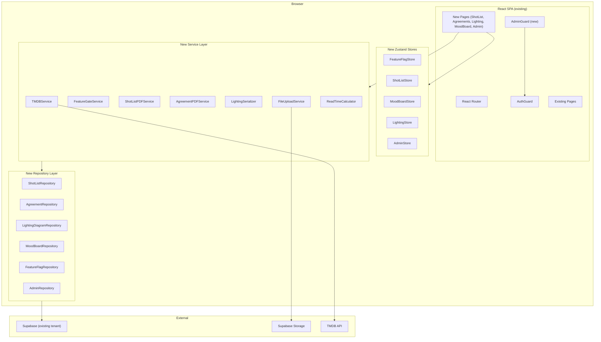
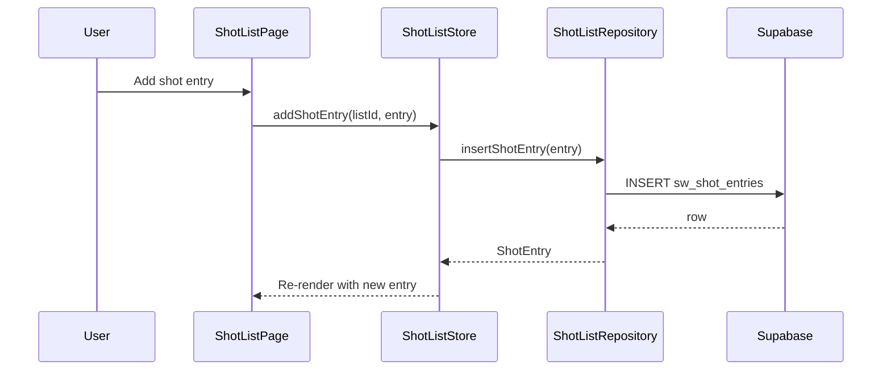
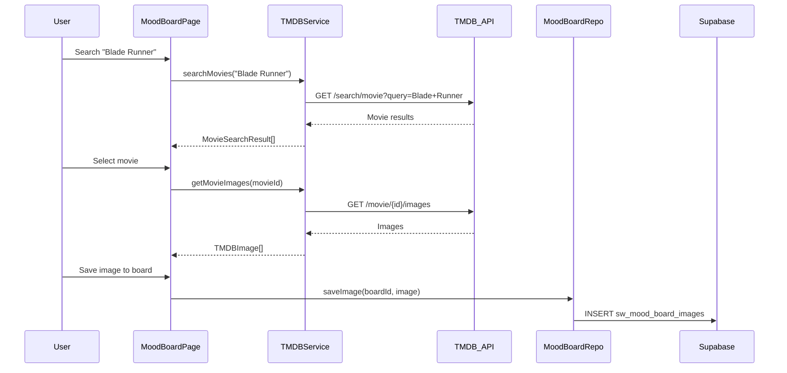
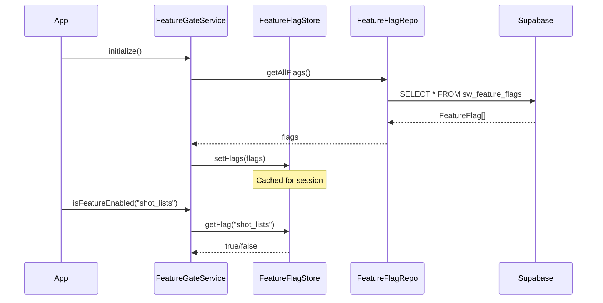
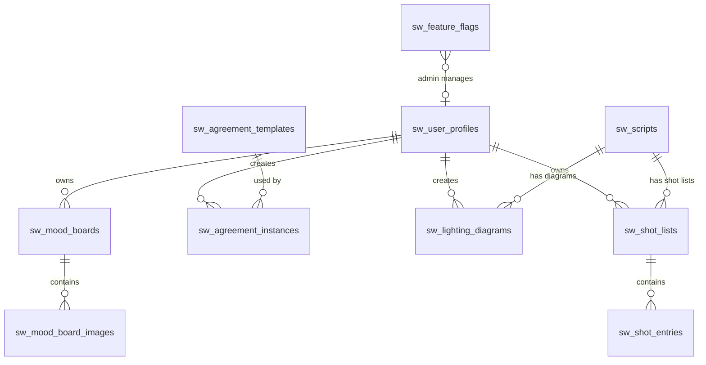

# Design Document — NexWriter Production Tools Expansion

## Overview

The Production Tools Expansion adds six new modules to NexWriter: Shot List Builder, Agreement Manager, Lighting Diagram Tool, TMDB Mood Board, Admin Panel, and a Feature Gating System. These modules extend the existing React 18 / TypeScript / Zustand / Supabase / Vite stack without modifying the core screenwriting editor.

All new data lives in the same Supabase project (ozzjcuamqslxjcfgtfhj) with `sw_` prefixed tables. File uploads (images, PDFs, signatures) use Supabase Storage with user-scoped paths. The TMDB API provides movie search and image browsing for mood boards. An admin panel provides platform management (analytics, user management, blog authoring, feature flags). A global feature flag system allows toggling each new module on/off without code deployments.

### Key Technical Choices

| Decision | Choice | Rationale |
|---|---|---|
| Canvas editor | Konva.js (react-konva) | Declarative React bindings for HTML5 Canvas; built-in drag-and-drop, hit detection, serialization to JSON |
| Signature capture | HTML5 Canvas (vanilla) | Lightweight, no extra dependency; only needs freehand drawing and PNG export |
| TMDB integration | Dedicated TMDBService class | Isolates API calls and attribution logic per TMDB ToS; easy to swap if licensing changes |
| Feature flags | sw_feature_flags table + Zustand FeatureFlagStore | Server-driven flags cached client-side; admin-togglable without deploys |
| Blog editor (admin) | TipTap (already installed) | Reuses existing dependency; supports headings, bold, italic, links, lists |
| PDF generation | jsPDF (already installed) | Client-side PDF for shot lists and agreements; no server dependency |
| File uploads | Supabase Storage | Already in stack; user-scoped paths prevent cross-user access |
| Drag-and-drop reorder | HTML5 Drag and Drop API | No extra dependency; sufficient for list reordering |
| Admin access control | Hardcoded email list + role column | Simple, no external auth provider needed; role column enables future flexibility |

## Architecture

### High-Level Module Integration



### Data Flow — Shot List CRUD



### Data Flow — TMDB Mood Board



### Data Flow — Feature Flag Check




## Components and Interfaces

### Updated Routing Structure

```typescript
const routes = [
  { path: '/login', element: <LoginPage /> },
  { path: '/signup', element: <SignupPage /> },
  {
    path: '/',
    element: <AuthGuard />,
    children: [
      { index: true, element: <DashboardPage /> },
      { path: 'editor/:scriptId', element: <EditorPage /> },
      { path: 'blueprint/new', element: <BlueprintWizardPage /> },
      { path: 'blueprint/:sessionId', element: <BlueprintWizardPage /> },
      { path: 'history/:scriptId', element: <VersionHistoryPage /> },
      { path: 'learn', element: <LearnHubPage /> },
      { path: 'learn/:postId', element: <BlogPostDetailPage /> },
      { path: 'settings', element: <SettingsPage /> },
      // --- New production tool routes ---
      { path: 'shots/:scriptId', element: <FeatureGate feature="shot_lists"><ShotListPage /></FeatureGate> },
      { path: 'agreements', element: <FeatureGate feature="agreements"><AgreementListPage /></FeatureGate> },
      { path: 'agreements/:instanceId', element: <FeatureGate feature="agreements"><AgreementEditorPage /></FeatureGate> },
      { path: 'lighting/:scriptId/:sceneIndex', element: <FeatureGate feature="lighting_diagrams"><LightingDiagramPage /></FeatureGate> },
      { path: 'moodboard', element: <FeatureGate feature="mood_boards"><MoodBoardPage /></FeatureGate> },
      { path: 'moodboard/:boardId', element: <FeatureGate feature="mood_boards"><MoodBoardDetailPage /></FeatureGate> },
      { path: 'credits', element: <CreditsPage /> },
      // --- Admin routes ---
      {
        path: 'admin',
        element: <AdminGuard />,
        children: [
          { index: true, element: <AdminDashboardPage /> },
          { path: 'users', element: <AdminUsersPage /> },
          { path: 'flags', element: <AdminFlagsPage /> },
          { path: 'blog', element: <AdminBlogListPage /> },
          { path: 'blog/new', element: <AdminBlogEditorPage /> },
          { path: 'blog/:postId', element: <AdminBlogEditorPage /> },
        ],
      },
    ],
  },
];
```

### Frontend Component Hierarchy (New Modules)

```
App (updated)
├── AuthGuard
│   ├── ... (existing pages)
│   ├── FeatureGate wrapper
│   │   ├── ShotListPage
│   │   │   ├── ShotListToolbar (scene selector, export button)
│   │   │   ├── ShotEntryTable / ShotEntryCardList (responsive)
│   │   │   │   └── ShotEntryRow / ShotEntryCard
│   │   │   │       ├── ShotTypeSelect
│   │   │   │       ├── ReferenceImageThumbnail
│   │   │   │       └── ImageUploadButton
│   │   │   └── ShotListEmptyState
│   │   ├── AgreementListPage
│   │   │   ├── TemplateGrid (built-in + custom)
│   │   │   └── AgreementInstanceList
│   │   ├── AgreementEditorPage
│   │   │   ├── FieldForm (dynamic fields from template)
│   │   │   ├── SignatureCanvas
│   │   │   └── AgreementExportButton
│   │   ├── LightingDiagramPage
│   │   │   ├── LightingToolbar (symbol palette, shape tools, export)
│   │   │   ├── KonvaCanvas (react-konva Stage + Layer)
│   │   │   │   ├── LightingSymbol (draggable)
│   │   │   │   ├── CameraMarker (draggable)
│   │   │   │   ├── ActorMarker (draggable, labeled)
│   │   │   │   └── WallShape / WindowShape / DoorShape
│   │   │   └── SymbolPalette (sidebar)
│   │   ├── MoodBoardPage
│   │   │   ├── TMDBSearchBar
│   │   │   ├── MovieResultGrid
│   │   │   ├── MovieImageGrid (stills + backdrops)
│   │   │   ├── ImageLightbox
│   │   │   └── BoardCollectionSidebar
│   │   ├── MoodBoardDetailPage
│   │   │   ├── SavedImageGrid
│   │   │   │   └── SavedImageCard (note + tags on hover)
│   │   │   └── BoardHeader (name, edit)
│   │   └── CreditsPage (TMDB attribution)
│   └── AdminGuard
│       ├── AdminDashboardPage
│       │   └── MetricsCardGrid (users, scripts, active users)
│       ├── AdminUsersPage
│       │   └── UserTable (paginated, lock/unlock actions)
│       ├── AdminFlagsPage
│       │   └── FeatureFlagList (toggle switches)
│       ├── AdminBlogListPage
│       │   └── BlogPostTable (title, status, actions)
│       └── AdminBlogEditorPage
│           ├── BlogMetaForm (title, slug, category, author)
│           ├── TipTapBlogEditor (WYSIWYG)
│           └── PublishControls (save draft, publish, unpublish)
└── PaywallModal (existing)
```

### FeatureGate Component

```typescript
interface FeatureGateProps {
  feature: FeatureKey;
  children: React.ReactNode;
}

/**
 * Wraps a route or component. If the feature flag is disabled,
 * renders a "Coming Soon" placeholder instead of the children.
 */
function FeatureGate({ feature, children }: FeatureGateProps): JSX.Element;
```

### AdminGuard Component

```typescript
/**
 * Route guard that checks if the current user is an admin.
 * Redirects non-admin users to the Dashboard.
 * Admin check: user email in ADMIN_EMAILS list OR role === 'admin' in sw_user_profiles.
 */
function AdminGuard(): JSX.Element;
```

### Service Interfaces

```typescript
// === New Types ===

type ShotType =
  | 'wide' | 'medium' | 'close-up' | 'extreme-close-up'
  | 'over-the-shoulder' | 'pov' | 'insert' | 'establishing'
  | 'two-shot' | 'aerial';

type FeatureKey =
  | 'shot_lists' | 'agreements' | 'lighting_diagrams'
  | 'mood_boards' | 'stripe_payments';

type LightingSymbolType =
  | 'key_light' | 'fill_light' | 'back_light' | 'hair_light'
  | 'bounce' | 'flag' | 'diffusion' | 'gel' | 'practical';

type DiagramElementType =
  | 'lighting_symbol' | 'camera' | 'actor'
  | 'wall' | 'window' | 'door';

interface ShotList {
  id: string;
  userId: string;
  scriptId: string | null;
  sceneHeading: string | null;
  title: string;
  createdAt: string;
  updatedAt: string;
}

interface ShotEntry {
  id: string;
  shotListId: string;
  shotNumber: number;
  shotType: ShotType;
  description: string;
  cameraAngle: string;
  cameraMovement: string;
  lens: string;
  notes: string;
  referenceImagePath: string | null;  // Supabase Storage path or TMDB URL
  shotOrder: number;
  createdAt: string;
  updatedAt: string;
}

interface AgreementTemplate {
  id: string;
  userId: string | null;       // null = built-in
  templateType: 'model_release' | 'location_release' | 'crew_deal_memo' | 'custom';
  name: string;
  fields: TemplateField[];     // JSON array of field definitions
  storagePath: string | null;  // for custom uploaded PDFs
  createdAt: string;
}

interface TemplateField {
  key: string;
  label: string;
  type: 'text' | 'date' | 'textarea';
  required: boolean;
}

interface AgreementInstance {
  id: string;
  userId: string;
  templateId: string;
  fieldValues: Record<string, string>;
  signaturePath: string | null;
  status: 'draft' | 'signed';
  createdAt: string;
  updatedAt: string;
}

interface DiagramElement {
  id: string;
  type: DiagramElementType;
  symbolType?: LightingSymbolType;
  x: number;
  y: number;
  rotation: number;
  label: string;
  width?: number;
  height?: number;
}

interface LightingDiagram {
  id: string;
  userId: string;
  scriptId: string;
  sceneIndex: number;
  sceneHeading: string;
  elements: DiagramElement[];
  canvasWidth: number;
  canvasHeight: number;
  createdAt: string;
  updatedAt: string;
}

interface MoodBoard {
  id: string;
  userId: string;
  scriptId: string | null;
  name: string;
  createdAt: string;
  updatedAt: string;
}

interface MoodBoardImage {
  id: string;
  moodBoardId: string;
  tmdbImagePath: string;
  tmdbMovieId: number;
  note: string;
  tags: string;          // comma-separated
  createdAt: string;
  updatedAt: string;
}

interface FeatureFlag {
  id: string;
  featureKey: FeatureKey;
  featureLabel: string;
  isEnabled: boolean;
  updatedAt: string;
}

interface MovieSearchResult {
  id: number;
  title: string;
  releaseDate: string;
  posterPath: string | null;
  genreIds: number[];
}

interface TMDBImage {
  filePath: string;
  width: number;
  height: number;
  type: 'backdrop' | 'still' | 'poster';
}

// === Repository Interfaces ===

interface IShotListRepository {
  getShotLists(userId: string, scriptId?: string): Promise<ShotList[]>;
  createShotList(list: Omit<ShotList, 'id' | 'createdAt' | 'updatedAt'>): Promise<ShotList>;
  deleteShotList(listId: string): Promise<void>;
  getShotEntries(shotListId: string): Promise<ShotEntry[]>;
  insertShotEntry(entry: Omit<ShotEntry, 'id' | 'createdAt' | 'updatedAt'>): Promise<ShotEntry>;
  updateShotEntry(entryId: string, updates: Partial<ShotEntry>): Promise<void>;
  deleteShotEntry(entryId: string): Promise<void>;
  reorderShotEntries(shotListId: string, orderedIds: string[]): Promise<void>;
}

interface IAgreementRepository {
  getTemplates(userId: string): Promise<AgreementTemplate[]>;
  createTemplate(template: Omit<AgreementTemplate, 'id' | 'createdAt'>): Promise<AgreementTemplate>;
  getInstances(userId: string): Promise<AgreementInstance[]>;
  getInstance(instanceId: string): Promise<AgreementInstance>;
  createInstance(instance: Omit<AgreementInstance, 'id' | 'createdAt' | 'updatedAt'>): Promise<AgreementInstance>;
  updateInstance(instanceId: string, updates: Partial<AgreementInstance>): Promise<void>;
}

interface ILightingDiagramRepository {
  getDiagram(scriptId: string, sceneIndex: number): Promise<LightingDiagram | null>;
  saveDiagram(diagram: Omit<LightingDiagram, 'id' | 'createdAt' | 'updatedAt'>): Promise<LightingDiagram>;
  updateDiagram(diagramId: string, elements: DiagramElement[]): Promise<void>;
}

interface IMoodBoardRepository {
  getBoards(userId: string, scriptId?: string): Promise<MoodBoard[]>;
  createBoard(board: Omit<MoodBoard, 'id' | 'createdAt' | 'updatedAt'>): Promise<MoodBoard>;
  deleteBoard(boardId: string): Promise<void>;
  getImages(boardId: string): Promise<MoodBoardImage[]>;
  saveImage(image: Omit<MoodBoardImage, 'id' | 'createdAt' | 'updatedAt'>): Promise<MoodBoardImage>;
  updateImage(imageId: string, updates: Partial<MoodBoardImage>): Promise<void>;
  deleteImage(imageId: string): Promise<void>;
}

interface IFeatureFlagRepository {
  getAllFlags(): Promise<FeatureFlag[]>;
  updateFlag(flagId: string, isEnabled: boolean): Promise<void>;
}

interface IAdminRepository {
  getTotalUsers(): Promise<number>;
  getTotalScripts(): Promise<number>;
  getActiveUsersLast7Days(): Promise<number>;
  getUsers(page: number, pageSize: number): Promise<{ users: AdminUserRow[]; total: number }>;
  lockUser(userId: string): Promise<void>;
  unlockUser(userId: string): Promise<void>;
}

interface AdminUserRow {
  id: string;
  email: string;
  displayName: string | null;
  tier: string;
  scriptCount: number;
  createdAt: string;
  lockedAt: string | null;
}

// === Service Interfaces ===

interface ITMDBService {
  searchMovies(query: string, options?: { genre?: number; yearStart?: number; yearEnd?: number }): Promise<MovieSearchResult[]>;
  getMovieImages(movieId: number): Promise<TMDBImage[]>;
  getImageUrl(path: string, size?: 'w200' | 'w500' | 'original'): string;
}

interface IFeatureGateService {
  initialize(): Promise<void>;
  isFeatureEnabled(featureKey: FeatureKey): boolean;
}

interface IFileUploadService {
  uploadFile(bucket: string, path: string, file: File): Promise<string>;
  validateFileType(file: File, allowedTypes: string[]): boolean;
  validateFileSize(file: File, maxSizeMB: number): boolean;
  getPublicUrl(bucket: string, path: string): string;
}

interface ILightingSerializer {
  serialize(elements: DiagramElement[], canvasWidth: number, canvasHeight: number): string;
  deserialize(json: string): { elements: DiagramElement[]; canvasWidth: number; canvasHeight: number };
}

interface IReadTimeCalculator {
  calculate(htmlContent: string): number;  // returns minutes
}
```

### New Zustand Stores

```typescript
// FeatureFlagStore
interface FeatureFlagState {
  flags: Record<FeatureKey, boolean>;
  loaded: boolean;
  setFlags: (flags: FeatureFlag[]) => void;
  isEnabled: (key: FeatureKey) => boolean;
}

// ShotListStore
interface ShotListState {
  currentList: ShotList | null;
  entries: ShotEntry[];
  loading: boolean;
  setCurrentList: (list: ShotList) => void;
  setEntries: (entries: ShotEntry[]) => void;
  addEntry: (entry: ShotEntry) => void;
  updateEntry: (id: string, updates: Partial<ShotEntry>) => void;
  removeEntry: (id: string) => void;
  reorderEntries: (orderedIds: string[]) => void;
}

// MoodBoardStore
interface MoodBoardState {
  boards: MoodBoard[];
  currentBoard: MoodBoard | null;
  images: MoodBoardImage[];
  searchResults: MovieSearchResult[];
  movieImages: TMDBImage[];
  setBoards: (boards: MoodBoard[]) => void;
  setCurrentBoard: (board: MoodBoard) => void;
  setImages: (images: MoodBoardImage[]) => void;
  setSearchResults: (results: MovieSearchResult[]) => void;
  setMovieImages: (images: TMDBImage[]) => void;
}

// LightingStore
interface LightingState {
  diagram: LightingDiagram | null;
  selectedElementId: string | null;
  setDiagram: (diagram: LightingDiagram) => void;
  addElement: (element: DiagramElement) => void;
  updateElement: (id: string, updates: Partial<DiagramElement>) => void;
  removeElement: (id: string) => void;
  selectElement: (id: string | null) => void;
}

// AdminStore
interface AdminState {
  metrics: { totalUsers: number; totalScripts: number; activeUsers7d: number } | null;
  users: AdminUserRow[];
  userTotal: number;
  userPage: number;
  blogPosts: BlogPost[];
  flags: FeatureFlag[];
  setMetrics: (m: AdminState['metrics']) => void;
  setUsers: (users: AdminUserRow[], total: number) => void;
  setUserPage: (page: number) => void;
}
```

### Konva.js Canvas Architecture (Lighting Diagram)

The lighting diagram uses react-konva with a declarative component tree:

```
<Stage width={canvasWidth} height={canvasHeight}>
  <Layer>
    {/* Background grid */}
    <GridLines spacing={20} />

    {/* Structural elements */}
    {walls.map(w => <WallShape key={w.id} {...w} draggable onDragEnd={handleDragEnd} />)}
    {windows.map(w => <WindowShape key={w.id} {...w} draggable onDragEnd={handleDragEnd} />)}
    {doors.map(d => <DoorShape key={d.id} {...d} draggable onDragEnd={handleDragEnd} />)}

    {/* Lighting symbols */}
    {lights.map(l => <LightingSymbol key={l.id} {...l} draggable onDragEnd={handleDragEnd} />)}

    {/* Camera and actors */}
    {cameras.map(c => <CameraMarker key={c.id} {...c} draggable onDragEnd={handleDragEnd} />)}
    {actors.map(a => <ActorMarker key={a.id} {...a} draggable onDragEnd={handleDragEnd} />)}

    {/* Selection transformer */}
    {selectedId && <Transformer ref={transformerRef} />}
  </Layer>
</Stage>
```

Each element is a Konva node with `draggable` enabled. On `onDragEnd`, the element's `x` and `y` are updated in the LightingStore. The entire `elements[]` array is serialized to JSON for persistence.

Lighting symbols are rendered as SVG-based Konva `Image` nodes loaded from inline SVG data URIs. Labels use Konva `Text` nodes positioned below each symbol.

### TMDB API Integration

```typescript
const TMDB_BASE_URL = 'https://api.themoviedb.org/3';
const TMDB_IMAGE_BASE = 'https://image.tmdb.org/t/p';

class TMDBService implements ITMDBService {
  private apiKey: string;
  private readAccessToken: string;

  constructor() {
    this.apiKey = import.meta.env.VITE_TMDB_API_KEY;
    this.readAccessToken = import.meta.env.VITE_TMDB_READ_ACCESS_TOKEN;
  }

  async searchMovies(query: string, options?: { genre?: number; yearStart?: number; yearEnd?: number }): Promise<MovieSearchResult[]> {
    const params = new URLSearchParams({ query, api_key: this.apiKey });
    if (options?.yearStart) params.set('primary_release_date.gte', `${options.yearStart}-01-01`);
    if (options?.yearEnd) params.set('primary_release_date.lte', `${options.yearEnd}-12-31`);
    const res = await fetch(`${TMDB_BASE_URL}/search/movie?${params}`);
    const data = await res.json();
    // Map and optionally filter by genre client-side
    return data.results.map(mapMovieResult);
  }

  async getMovieImages(movieId: number): Promise<TMDBImage[]> {
    const res = await fetch(`${TMDB_BASE_URL}/movie/${movieId}/images?api_key=${this.apiKey}`);
    const data = await res.json();
    return [...data.backdrops.map(mapBackdrop), ...(data.stills ?? []).map(mapStill)];
  }

  getImageUrl(path: string, size: 'w200' | 'w500' | 'original' = 'w500'): string {
    return `${TMDB_IMAGE_BASE}/${size}${path}`;
  }
}
```

### File Upload Service

```typescript
class FileUploadService implements IFileUploadService {
  private readonly ALLOWED_IMAGE_TYPES = ['image/jpeg', 'image/png', 'image/webp'];
  private readonly ALLOWED_PDF_TYPES = ['application/pdf'];
  private readonly ALLOWED_SIGNATURE_TYPES = ['image/png'];

  async uploadFile(bucket: string, path: string, file: File): Promise<string> {
    const { error } = await supabase.storage.from(bucket).upload(path, file, { upsert: true });
    if (error) throw new AppError(error.message, 'UPLOAD_FAILED', 'File upload failed. Please try again.', true);
    return path;
  }

  validateFileType(file: File, allowedTypes: string[]): boolean {
    return allowedTypes.includes(file.type);
  }

  validateFileSize(file: File, maxSizeMB: number): boolean {
    return file.size <= maxSizeMB * 1024 * 1024;
  }

  getPublicUrl(bucket: string, path: string): string {
    const { data } = supabase.storage.from(bucket).getPublicUrl(path);
    return data.publicUrl;
  }
}
```

Storage path conventions:
- `shots/{userId}/{filename}` — shot reference images
- `agreements/{userId}/{filename}` — custom agreement PDFs
- `signatures/{userId}/{filename}` — signature PNGs
- `lighting/{userId}/{filename}` — exported lighting diagram images

### Signature Capture

The signature canvas uses a vanilla HTML5 Canvas element (not Konva) for simplicity:

```typescript
class SignatureCapture {
  private canvas: HTMLCanvasElement;
  private ctx: CanvasRenderingContext2D;
  private drawing: boolean = false;

  // Handles mousedown/touchstart, mousemove/touchmove, mouseup/touchend
  // Draws freehand strokes on the canvas

  toBlob(): Promise<Blob> {
    return new Promise(resolve => this.canvas.toBlob(blob => resolve(blob!), 'image/png'));
  }

  clear(): void {
    this.ctx.clearRect(0, 0, this.canvas.width, this.canvas.height);
  }
}
```

### Read Time Calculator

```typescript
/**
 * Pure function: strips HTML tags, counts words, divides by 200 wpm, rounds up.
 */
function calculateReadTime(htmlContent: string): number {
  const text = htmlContent.replace(/<[^>]*>/g, '');
  const wordCount = text.trim().split(/\s+/).filter(Boolean).length;
  return Math.max(1, Math.ceil(wordCount / 200));
}
```

### Admin Panel Architecture

The admin panel reuses the existing AuthGuard and adds an AdminGuard layer:

1. AdminGuard checks `useAuthStore().user.email` against a hardcoded `ADMIN_EMAILS` array (env var `VITE_ADMIN_EMAILS`)
2. Fallback: checks `role` column in `sw_user_profiles` for `'admin'`
3. Non-admin users are redirected to `/`

Admin pages use the AdminRepository for all Supabase queries. The blog editor reuses the existing TipTap dependency with a minimal configuration (headings, bold, italic, links, lists).

### Shot Number Renumbering Logic

```typescript
/**
 * Pure function: given an ordered array of shot entries, returns new entries
 * with shotNumber reassigned sequentially starting from 1.
 */
function renumberShots(entries: ShotEntry[]): ShotEntry[] {
  return entries.map((entry, index) => ({
    ...entry,
    shotNumber: index + 1,
  }));
}
```


## Data Models

### New Supabase Tables (all prefixed `sw_`)

#### sw_user_profiles (ALTER — add columns)

| Column | Type | Change | Description |
|---|---|---|---|
| role | text | ADD, NOT NULL DEFAULT 'user', CHECK (role IN ('user', 'admin')) | User role for admin access |
| locked_at | timestamptz | ADD, nullable | Non-null = account locked |

#### sw_shot_lists

| Column | Type | Constraints | Description |
|---|---|---|---|
| id | uuid | PK, DEFAULT gen_random_uuid() | |
| user_id | uuid | NOT NULL, FK → sw_user_profiles.id ON DELETE CASCADE | Owner |
| script_id | uuid | FK → sw_scripts.id ON DELETE SET NULL | Linked script (optional) |
| scene_heading | text | | Scene heading text if linked to a scene |
| title | text | NOT NULL, DEFAULT 'Untitled Shot List' | |
| created_at | timestamptz | NOT NULL, DEFAULT now() | |
| updated_at | timestamptz | NOT NULL, DEFAULT now() | |

RLS: Users can SELECT/INSERT/UPDATE/DELETE only their own rows (`auth.uid() = user_id`).

#### sw_shot_entries

| Column | Type | Constraints | Description |
|---|---|---|---|
| id | uuid | PK, DEFAULT gen_random_uuid() | |
| shot_list_id | uuid | NOT NULL, FK → sw_shot_lists.id ON DELETE CASCADE | |
| shot_number | int | NOT NULL | Display number (auto-assigned) |
| shot_type | text | NOT NULL, CHECK (shot_type IN ('wide','medium','close-up','extreme-close-up','over-the-shoulder','pov','insert','establishing','two-shot','aerial')) | |
| description | text | NOT NULL DEFAULT '' | |
| camera_angle | text | NOT NULL DEFAULT '' | |
| camera_movement | text | NOT NULL DEFAULT '' | |
| lens | text | NOT NULL DEFAULT '' | |
| notes | text | NOT NULL DEFAULT '' | |
| reference_image_path | text | | Supabase Storage path or TMDB URL |
| shot_order | int | NOT NULL | For drag-and-drop ordering |
| created_at | timestamptz | NOT NULL, DEFAULT now() | |
| updated_at | timestamptz | NOT NULL, DEFAULT now() | |

RLS: Users can SELECT/INSERT/UPDATE/DELETE entries for their own shot lists (join through sw_shot_lists.user_id).

#### sw_agreement_templates

| Column | Type | Constraints | Description |
|---|---|---|---|
| id | uuid | PK, DEFAULT gen_random_uuid() | |
| user_id | uuid | FK → sw_user_profiles.id ON DELETE CASCADE | null = built-in template |
| template_type | text | NOT NULL, CHECK (template_type IN ('model_release','location_release','crew_deal_memo','custom')) | |
| name | text | NOT NULL | |
| fields | jsonb | NOT NULL DEFAULT '[]' | TemplateField[] JSON |
| storage_path | text | | For custom uploaded PDFs |
| created_at | timestamptz | NOT NULL, DEFAULT now() | |

RLS: All authenticated users can SELECT where `user_id IS NULL` (built-in). Users can SELECT/INSERT/UPDATE/DELETE their own custom templates (`auth.uid() = user_id`).

#### sw_agreement_instances

| Column | Type | Constraints | Description |
|---|---|---|---|
| id | uuid | PK, DEFAULT gen_random_uuid() | |
| user_id | uuid | NOT NULL, FK → sw_user_profiles.id ON DELETE CASCADE | |
| template_id | uuid | NOT NULL, FK → sw_agreement_templates.id | |
| field_values | jsonb | NOT NULL DEFAULT '{}' | Record<string, string> |
| signature_path | text | | Supabase Storage path to signature PNG |
| status | text | NOT NULL DEFAULT 'draft', CHECK (status IN ('draft','signed')) | |
| created_at | timestamptz | NOT NULL, DEFAULT now() | |
| updated_at | timestamptz | NOT NULL, DEFAULT now() | |

RLS: Users can SELECT/INSERT/UPDATE/DELETE only their own rows (`auth.uid() = user_id`).

#### sw_lighting_diagrams

| Column | Type | Constraints | Description |
|---|---|---|---|
| id | uuid | PK, DEFAULT gen_random_uuid() | |
| user_id | uuid | NOT NULL, FK → sw_user_profiles.id ON DELETE CASCADE | |
| script_id | uuid | NOT NULL, FK → sw_scripts.id ON DELETE CASCADE | |
| scene_index | int | NOT NULL | Scene number in the script |
| scene_heading | text | NOT NULL | Scene heading text |
| elements | jsonb | NOT NULL DEFAULT '[]' | DiagramElement[] |
| canvas_width | int | NOT NULL DEFAULT 800 | |
| canvas_height | int | NOT NULL DEFAULT 600 | |
| created_at | timestamptz | NOT NULL, DEFAULT now() | |
| updated_at | timestamptz | NOT NULL, DEFAULT now() | |

RLS: Users can SELECT/INSERT/UPDATE/DELETE only their own rows (`auth.uid() = user_id`). UNIQUE constraint on `(user_id, script_id, scene_index)`.

#### sw_mood_boards

| Column | Type | Constraints | Description |
|---|---|---|---|
| id | uuid | PK, DEFAULT gen_random_uuid() | |
| user_id | uuid | NOT NULL, FK → sw_user_profiles.id ON DELETE CASCADE | |
| script_id | uuid | FK → sw_scripts.id ON DELETE SET NULL | Optional project link |
| name | text | NOT NULL | |
| created_at | timestamptz | NOT NULL, DEFAULT now() | |
| updated_at | timestamptz | NOT NULL, DEFAULT now() | |

RLS: Users can SELECT/INSERT/UPDATE/DELETE only their own rows (`auth.uid() = user_id`).

#### sw_mood_board_images

| Column | Type | Constraints | Description |
|---|---|---|---|
| id | uuid | PK, DEFAULT gen_random_uuid() | |
| mood_board_id | uuid | NOT NULL, FK → sw_mood_boards.id ON DELETE CASCADE | |
| tmdb_image_path | text | NOT NULL | TMDB image file_path |
| tmdb_movie_id | int | NOT NULL | TMDB movie ID |
| note | text | NOT NULL DEFAULT '' | User note |
| tags | text | NOT NULL DEFAULT '' | Comma-separated tags |
| created_at | timestamptz | NOT NULL, DEFAULT now() | |
| updated_at | timestamptz | NOT NULL, DEFAULT now() | |

RLS: Users can SELECT/INSERT/UPDATE/DELETE images for their own mood boards (join through sw_mood_boards.user_id).

#### sw_feature_flags

| Column | Type | Constraints | Description |
|---|---|---|---|
| id | uuid | PK, DEFAULT gen_random_uuid() | |
| feature_key | text | NOT NULL, UNIQUE | e.g., 'shot_lists', 'agreements' |
| feature_label | text | NOT NULL | Human-readable label |
| is_enabled | boolean | NOT NULL DEFAULT false | |
| updated_at | timestamptz | NOT NULL, DEFAULT now() | |

RLS: All authenticated users can SELECT. Only admin users can UPDATE (`EXISTS (SELECT 1 FROM sw_user_profiles WHERE id = auth.uid() AND role = 'admin')`).

Seed data:
```sql
INSERT INTO sw_feature_flags (feature_key, feature_label, is_enabled) VALUES
  ('shot_lists', 'Shot List Builder', true),
  ('agreements', 'Agreement Manager', true),
  ('lighting_diagrams', 'Lighting Diagram Tool', true),
  ('mood_boards', 'Mood Board', true),
  ('stripe_payments', 'Stripe Payments', false);
```

#### sw_blog_posts (ALTER — add admin write policies)

The existing `sw_blog_posts` table needs updated RLS to allow admin INSERT/UPDATE/DELETE:

```sql
CREATE POLICY "Admins can insert blog posts"
  ON sw_blog_posts FOR INSERT
  WITH CHECK (
    EXISTS (SELECT 1 FROM sw_user_profiles WHERE id = auth.uid() AND role = 'admin')
  );

CREATE POLICY "Admins can update blog posts"
  ON sw_blog_posts FOR UPDATE
  USING (
    EXISTS (SELECT 1 FROM sw_user_profiles WHERE id = auth.uid() AND role = 'admin')
  );

CREATE POLICY "Admins can delete blog posts"
  ON sw_blog_posts FOR DELETE
  USING (
    EXISTS (SELECT 1 FROM sw_user_profiles WHERE id = auth.uid() AND role = 'admin')
  );
```

### Entity Relationship Diagram (New Tables)




## Correctness Properties

*A property is a characteristic or behavior that should hold true across all valid executions of a system — essentially, a formal statement about what the system should do. Properties serve as the bridge between human-readable specifications and machine-verifiable correctness guarantees.*

### Property 1: Shot Renumbering Produces Sequential Numbers

*For any* array of shot entries (of any length 0..N), applying `renumberShots` SHALL produce an array where each entry's `shotNumber` equals its 1-based index (i.e., the i-th entry has `shotNumber === i + 1`), and the array length is preserved.

**Validates: Requirements 1.3, 1.5, 3.2**

### Property 2: File Validation Correctness

*For any* file size (non-negative number) and size limit (positive number), `validateFileSize` SHALL return `true` if and only if the file size is less than or equal to the limit in bytes. *For any* file MIME type string and allowed-types list, `validateFileType` SHALL return `true` if and only if the file type is contained in the allowed-types list.

**Validates: Requirements 2.4, 6.2, 22.4**

### Property 3: Lighting Diagram Serialization Round-Trip

*For any* valid array of `DiagramElement[]` with canvas dimensions, serializing via `LightingSerializer.serialize` and then deserializing via `LightingSerializer.deserialize` SHALL produce a diagram state equivalent to the original (same elements with same positions, types, labels, dimensions, and canvas size).

**Validates: Requirements 9.1, 9.2, 9.3**

### Property 4: TMDB Genre Filter Returns Only Matching Movies

*For any* list of `MovieSearchResult[]` and a target genre ID, filtering by genre SHALL return a list where every result's `genreIds` array contains the target genre ID, and no results with the target genre are excluded.

**Validates: Requirements 10.2**

### Property 5: Admin Access Check Correctness

*For any* user with an email and role, `isAdmin` SHALL return `true` if and only if the user's email is in the admin email list OR the user's role is `'admin'`. For all other combinations, it SHALL return `false`.

**Validates: Requirements 13.1**

### Property 6: Locked User Login Prevention

*For any* user record, if `locked_at` is non-null, the authentication check SHALL return a rejection (login blocked). If `locked_at` is null, the authentication check SHALL not block login based on lock status.

**Validates: Requirements 15.4**

### Property 7: Feature Flag Check Correctness

*For any* map of feature flags (FeatureKey → boolean) and any feature key, `isFeatureEnabled` SHALL return the boolean value stored for that key, or `false` if the key is not present in the map.

**Validates: Requirements 16.4, 19.5**

### Property 8: Stripe Payments Disabled Grants Full Access

*For any* user tier and any gated feature, when the `stripe_payments` feature flag is disabled, the combined access check (feature flag + tier gate) SHALL return `true` (full access granted regardless of tier).

**Validates: Requirements 17.1**

### Property 9: Read Time Calculation

*For any* HTML string, `calculateReadTime` SHALL return `Math.max(1, Math.ceil(wordCount / 200))` where `wordCount` is the number of whitespace-separated tokens in the text after stripping all HTML tags.

**Validates: Requirements 18.7**

### Property 10: Storage Path Construction

*For any* user ID string and filename string, the constructed storage path SHALL match the pattern `{prefix}/{userId}/{filename}` where prefix is one of the defined bucket prefixes (shots, agreements, signatures, lighting).

**Validates: Requirements 22.2**

## Error Handling

### Error Code Extensions

The existing `ErrorCode` type is extended with new codes for production tool operations:

```typescript
type ErrorCode =
  | /* ...existing codes... */
  | 'UPLOAD_FAILED'
  | 'UPLOAD_FILE_TOO_LARGE'
  | 'UPLOAD_INVALID_TYPE'
  | 'TMDB_SEARCH_FAILED'
  | 'TMDB_IMAGES_FAILED'
  | 'SHOT_LIST_SAVE_FAILED'
  | 'AGREEMENT_SAVE_FAILED'
  | 'DIAGRAM_SAVE_FAILED'
  | 'MOOD_BOARD_SAVE_FAILED'
  | 'ADMIN_ACTION_FAILED'
  | 'FEATURE_FLAG_LOAD_FAILED'
  | 'ACCOUNT_LOCKED';
```

### Error Handling Patterns

All new repositories follow the existing `AppError` pattern from `ScriptRepository`:

1. Every Supabase call checks for errors and throws `AppError` with a user-friendly message
2. File upload errors include the specific failure reason (size, type, network)
3. TMDB API errors are caught and surfaced as `AppError` with retry suggestion
4. Feature flag load failures default to all features enabled (fail-open for user experience)
5. Admin actions that fail show the error in a toast notification
6. Locked account detection happens at login time — `AuthRepository.signIn` checks `locked_at` before returning the session

### File Upload Error Flow

```
User selects file
  → validateFileType(file, allowedTypes)
    → false: show "Invalid file type. Allowed: JPEG, PNG, WebP" (no upload attempted)
  → validateFileSize(file, maxSizeMB)
    → false: show "File too large. Maximum size: {maxSizeMB} MB" (no upload attempted)
  → uploadFile(bucket, path, file)
    → Supabase error: show "Upload failed. Please try again." (form state preserved)
    → Success: update record with storage path
```

### TMDB API Error Handling

- Network errors: show "Unable to search movies. Check your connection and try again."
- Rate limiting (429): show "Too many requests. Please wait a moment and try again."
- Invalid API key: show "Movie search is temporarily unavailable." (log error for admin)
- Empty results: show "No movies found. Try a different search term."

## Testing Strategy

### Dual Testing Approach

This feature uses both unit tests and property-based tests for comprehensive coverage.

**Unit tests** cover:
- Component rendering (FeatureGate, AdminGuard, shot list table/cards, mood board grid)
- TMDB API integration with mocked responses
- Supabase repository operations with mocked client
- PDF generation output validation
- Signature canvas capture flow
- Admin panel CRUD operations
- Blog editor save/publish/unpublish flows
- Responsive layout breakpoint behavior

**Property-based tests** cover the 10 correctness properties defined above, using `fast-check` (already installed in the project).

### Property-Based Testing Configuration

- Library: `fast-check` v4.6.0 (already in devDependencies)
- Minimum iterations: 100 per property test
- Each test file references its design property with a tag comment
- Tag format: `Feature: production-tools-expansion, Property {number}: {title}`

### Property Test Files

| Property | Test File | Pure Function Under Test |
|---|---|---|
| 1: Shot Renumbering | `src/services/__tests__/shotRenumbering.property.test.ts` | `renumberShots` |
| 2: File Validation | `src/services/__tests__/fileValidation.property.test.ts` | `validateFileSize`, `validateFileType` |
| 3: Lighting Diagram Round-Trip | `src/services/__tests__/lightingSerializer.property.test.ts` | `LightingSerializer.serialize/deserialize` |
| 4: TMDB Genre Filter | `src/services/__tests__/tmdbGenreFilter.property.test.ts` | `filterByGenre` |
| 5: Admin Access Check | `src/services/__tests__/adminAccess.property.test.ts` | `isAdmin` |
| 6: Locked User Check | `src/services/__tests__/lockedUser.property.test.ts` | `isAccountLocked` |
| 7: Feature Flag Check | `src/services/__tests__/featureFlag.property.test.ts` | `isFeatureEnabled` |
| 8: Stripe Disabled Access | `src/services/__tests__/stripeDisabledAccess.property.test.ts` | `checkAccess` (combined flag + tier) |
| 9: Read Time Calculation | `src/services/__tests__/readTimeCalculator.property.test.ts` | `calculateReadTime` |
| 10: Storage Path Construction | `src/services/__tests__/storagePath.property.test.ts` | `buildStoragePath` |

### Unit Test Coverage Areas

| Module | Key Test Scenarios |
|---|---|
| ShotListRepository | CRUD operations, reorder persistence |
| AgreementRepository | Template fetch (built-in + custom), instance save |
| LightingDiagramRepository | Save/load diagram, upsert on conflict |
| MoodBoardRepository | Board CRUD, image save/update/delete |
| TMDBService | Search with filters, image fetch, error handling |
| FeatureGateService | Init loads flags, disabled flag shows placeholder |
| AdminRepository | Metrics queries, user list pagination, lock/unlock |
| FileUploadService | Upload success, upload failure, path construction |
| AdminGuard | Redirect non-admin, allow admin |
| FeatureGate | Render children when enabled, render placeholder when disabled |
| SignatureCanvas | Draw, clear, export to blob |
| BlogRepository | Upsert post, publish/unpublish |

